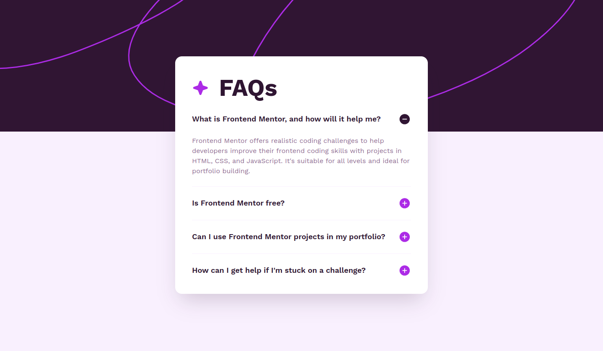

# Frontend Mentor - FAQs accordion solution

This is a solution to the [FAQs accordion challenge on Frontend Mentor](https://www.frontendmentor.io/challenges/faq-accordion-wyfFdeBwBz).
Frontend Mentor challenges help you improve your coding skills by building realistic projects.

## Table of contents

- [Overview](#overview)
  - [Screenshot](#screenshot)
  - [Links](#links)
  - [Links](#links)
- [Built with](#built_with)
- [Acknowledgments](#acknowledgments)

## Overview

### Screenshot

### Links

-Solution URL: [https://www.frontendmentor.io/solutions/my---faqs-accordion-solution-QTIdhJ_6rP](https://www.frontendmentor.io/solutions/my---faqs-accordion-solution-QTIdhJ_6rP)

-Live Site URL: [https://gabrieljesuss.github.io/frontendmentor_faq-accordion/](https://gabrieljesuss.github.io/frontendmentor_faq-accordion/)

### Built with

- Semantic HTML5 markup
- Tailwind CSS
- Mobile-first
- [Parcel](https://parceljs.org/) - JS Bundler

## Author

- Frontend Mentor - [@GabrielJesusS](https://www.frontendmentor.io/profile/GabrielJesusS)
